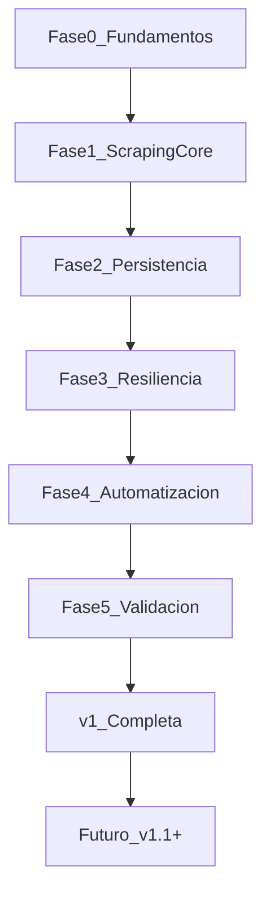

# Roadmap — Luma Event Scraper

**Creado:** 11 de julio de 2026  
**Última actualización:** 11 de julio de 2026 (v1 completada)  
**Especificación de referencia:** [prd.md](prd.md)

---

## Propósito

Este documento es la **guía operativa del proyecto**. Traduce el [PRD](prd.md) en un plan de desarrollo secuencial con ítems trackeables. Se actualiza a medida que avanzamos: marcar progreso aquí, no en el PRD.

### Convención de estados

| Símbolo | Estado |
|---|---|
| `[ ]` | Pendiente |
| `[~]` | En progreso |
| `[x]` | Completado |

Cada ítem referencia su requisito del PRD (`RF-x` o `RNF-x`) cuando aplica.

---

## Visión y meta v1

**Objetivo:** Automatizar la detección diaria de eventos nuevos de tech/AI en Luma (lu.ma), sin API oficial ni intervención manual.

**Métricas de éxito (PRD §9):**

| Métrica | Meta |
|---|---|
| Eventos nuevos detectados por semana | > 0 de forma consistente |
| Tasa de error de corridas (fallos no recuperados) | < 5% |
| Falsos duplicados (evento reportado como nuevo más de una vez) | 0 |
| Cobertura geográfica | ≥ 5 ciudades/regiones por corrida |

---

## Flujo de fases



---

## Fase 0 — Fundamentos del proyecto

> Dependencias: ninguna. Punto de partida del repo.

- [x] **RNF-4** Crear estructura base: `scraper.py`, `config.py`, `.gitignore` (archivos de estado excluidos del repo)
- [x] **RF-10** Definir configuración externa en `config.py`: categorías `["tech", "ai"]` y ≥ 5 ciudades con `{name, lat, lon}`
- [x] **CLI** Implementar entry point: `python scraper.py` y flag `--dry-run` (sin escribir archivos de salida)

**Entregables:** `scraper.py`, `config.py`, `.gitignore`

---

## Fase 1 — Núcleo de scraping

> Dependencias: Fase 0 completada.

- [x] **RF-1, RNF-1** Cliente HTTP al endpoint `api.luma.com/discover/get-paginated-events` por cada par `(categoría, ciudad)`
- [x] **RF-2** Paginación automática con `pagination_cursor` hasta agotar resultados o alcanzar límite de seguridad de páginas
- [x] **RF-5, RNF-6** Parseo de eventos: extraer `api_id`, `name`, `url`, `start_date` + contexto (`city`, `category`)

**Entregables:** Lógica de consulta y parseo funcional en `scraper.py`

---

## Fase 2 — Persistencia y deduplicación

> Dependencias: Fase 1 completada.

- [x] **RF-3, RF-4** Índice de deduplicación en `seen_events.json` keyed por `api_id`, persistido entre corridas
- [x] **RF-5** Generar `new_events_<YYYY-MM-DD>.csv` con campos mínimos: `name`, `url`, `start_date`, `city`, `category`, `first_seen`
- [x] **RF-6** Mantener `events_master.csv` como historial append-only de todos los eventos detectados

**Entregables:** `seen_events.json`, `events_master.csv`, `new_events_<fecha>.csv`

---

## Fase 3 — Resiliencia y observabilidad

> Dependencias: Fase 2 completada.

- [x] **RF-8** Reintentos automáticos con backoff exponencial ante fallos de red transitorios
- [x] **RNF-2** Pausas aleatorias entre requests; sin concurrencia agresiva
- [x] **RNF-3** Tolerancia a cambios de esquema: fallo en parseo de un campo → log + continuar; log de payload inesperado
- [x] **RF-9** Logging de cada corrida: eventos consultados, eventos nuevos, errores encontrados

**Entregables:** Manejo de errores robusto y logs estructurados por corrida

---

## Fase 4 — Automatización y despliegue

> Dependencias: Fase 3 completada.

- [x] **RF-7** Workflow de GitHub Actions en `.github/workflows/scrape.yml` con `cron: '0 8 * * *'`
- [x] **RF-4, RF-7** Persistencia de estado en CI: commit de `seen_events.json` + CSVs, o cache/artifact en Actions
- [x] **CLI** Validar modo `--dry-run`: conectividad al endpoint sin escribir archivos de salida

**Entregables:** `.github/workflows/scrape.yml`, pipeline programado funcional

---

## Fase 5 — Validación de v1

> Dependencias: Fase 4 completada.

- [x] **Métricas §9** Corrida end-to-end local: pipeline completo sin errores no recuperados
- [x] **Métricas §9** Verificar deduplicación: segunda corrida consecutiva reporta 0 eventos duplicados como nuevos
- [x] **RF-10, Métricas §9** Verificar cobertura: ≥ 5 ciudades consultadas por corrida
- [x] **Docs** Documentar comandos de uso y mantenimiento (README o sección en este roadmap)

**Criterio de done:** v1 lista para operar en producción diaria. **Validada el 11 jul 2026.**

### Resultados de validación

| Prueba | Resultado |
|---|---|
| Corrida end-to-end | 12/12 combinaciones, 1386 eventos, 0 errores |
| Deduplicación (2ª corrida) | 0 eventos nuevos duplicados |
| Cobertura geográfica | 6 ciudades consultadas |
| Documentación | [README.md](README.md) |

---

## Estado actual del proyecto

| Fase | Estado | Progreso |
|---|---|---|
| Fase 0 — Fundamentos | Completada | 3/3 |
| Fase 1 — Núcleo de scraping | Completada | 3/3 |
| Fase 2 — Persistencia | Completada | 3/3 |
| Fase 3 — Resiliencia | Completada | 4/4 |
| Fase 4 — Automatización | Completada | 3/3 |
| Fase 5 — Validación | Completada | 4/4 |
| **v1 completa** | **Completada** | **20/20 ítems** |

---

## Roadmap futuro (post-v1)

> Todos los ítems siguientes requieren **v1 completa**.

### v1.1 — Notificaciones
- [ ] Alertas automáticas (Slack / Telegram / email) cuando se detecten eventos nuevos en `new_events_<fecha>.csv`

### v1.2 — Filtrado
- [ ] Filtrado por palabras clave en nombre o descripción del evento

### v2 — Enriquecimiento y visualización
- [ ] Enriquecimiento con datos de hosts (redes sociales) para lead-gen
- [ ] Dashboard web simple para visualizar el historial de eventos

---

## Preguntas abiertas

Decisiones pendientes del [PRD §12](prd.md) que pueden afectar la configuración o el alcance:

1. **Uso previsto:** ¿Personal/research o fin comercial (lead-gen, reventa de datos)? Determina rigor en revisión de Términos de Servicio de Luma.
2. **Cobertura geográfica:** ¿Global o ciudades específicas (ej. Lima + hubs tech principales)? Afecta la lista en `config.py`.
3. **Alertamiento:** ¿Tiempo real o basta con el reporte diario acumulado? Afecta prioridad de v1.1.

---

## Cómo mantener este documento

1. **Al empezar un ítem:** cambiar `[ ]` → `[~]`
2. **Al completar un ítem:** cambiar `[~]` → `[x]` y actualizar la tabla "Estado actual del proyecto"
3. **Al cerrar una fase:** verificar que todos sus ítems estén `[x]` antes de avanzar a la siguiente
4. **Siempre:** actualizar la fecha en "Última actualización" al editar este archivo
5. **No duplicar el PRD:** el roadmap es operativo; cambios de especificación van en [prd.md](prd.md)

### Comandos esperados (referencia)

```bash
python scraper.py           # ejecutar una corrida completa
python scraper.py --dry-run # validar conectividad sin escribir archivos
```
